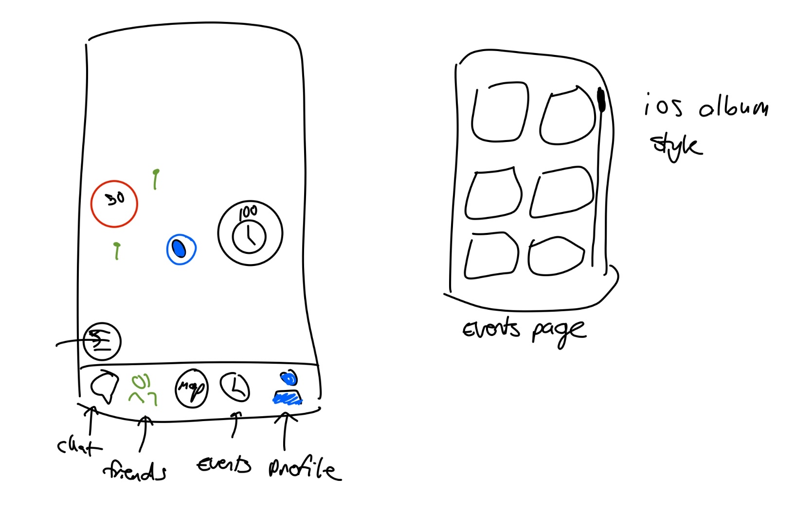

# HW3: UI Prototyping — SquadSeeker

**Team Members:** Anna Lee (chaeeul3), Manas Kottakota (kottakom), Nikash Malhotra (nikashm), Tanmay Garg (tanmayg1), Jared Yrastorza (jryrasto)

## Files in this folder

- **`SquadSeeker_UI_Prototype.html`** — the full, self-contained interactive prototype (committed to the repo). Open it in any browser. The left sidebar switches between all 14 screens; the right-hand panel annotates each screen with its intent, key elements, and the Nielsen heuristics it demonstrates.
- **`SS_U_Mock.png`** — the original hand-drawn sketch from our first design session (early iteration; see below).

> The descriptions and heuristic evaluation below are written directly into this document (Part 1 and Part 2) so the deliverable is self-contained and does not depend on any external link.

---

## Part 1 — UI Mockups and Analysis

### Design process & iteration

We designed the interface in two passes, and both are committed so the process is visible.

**Pass 1 — hand sketch (`SS_U_Mock.png`).** We started on paper to settle the core spatial ideas before touching software:

The sketch already captures the central concepts that survived into the final design: a **map** with an aggregated **count bubble** ("30"), individual **pins**, an **event marker** (the "100" clock circle), a **recenter/locate control** (bottom-left circle), and a **bottom tab bar**. It also shows ideas we *changed* on the way to the software mockup:

- The early tab bar was **Chat · Friends · Events · Profile**. In the refined prototype the primary navigation became **Map · Interests · Events/Chats · Profile**, because the map (not chat) is the app's home surface and interest management needed a first-class destination.
- The separate "events page — iOS album style" grid sketch was folded into map-pinned events plus an event detail screen, rather than a standalone gallery, to keep events grounded in location.

**Pass 2 — software mockup (`SquadSeeker_UI_Prototype.html`).** We then built a prescriptive, interactive prototype: a fixed iPhone frame, real type and color tokens, and 14 navigable screens covering the full onboarding flow, both map states, and the core screens. This is the authoritative mockup; the per-screen descriptions below correspond to it.

### How to view

Open `SquadSeeker_UI_Prototype.html` in a browser. Use the sidebar (or **Prev/Next**) to move between screens. Each screen's annotation panel mirrors the descriptions below.

### Screen-by-screen descriptions

Each entry states **what the screen shows**, **what the key elements represent**, and **how the user interacts with it**.

#### Onboarding Flow

**Screen 01 — Welcome / Sign-in.**
First contact; communicates the app identity in one glance and offers sign-in with clear hierarchy. The top ~40% is the **app logo + name** with the single tagline "Find your people, right where you are." Below are three account paths in deliberate visual priority: **Sign in with Apple** (system-required black button), **Sign in with Google** (system-required white button), and **"Use email instead"** rendered as a lower-weight text link. An **"Already have an account?"** inline link sits at the bottom. The user taps one path to authenticate; returning users with a saved session bypass this screen entirely, and email/password requires verification before advancing.

**Screen 02 — Explainer Slides.**
A 3–4 slide, trust-building sequence shown once per account, before any permission request, so consent is informed. Each slide has a single **iconographic illustration**, a one-line **title**, and a 2–3 line **body** (one concrete privacy fact per line — proximity matching, what strangers can see, blackout zones). A **"Skip" link** is always visible top-right, and a **tappable dot indicator** allows non-linear navigation; on the final slide a **"Get Started"** button replaces the dots. The user swipes/taps through or skips; the system back gesture is disabled so the flow stays linear.

**Screen 03 — Username Selection.**
Collects the permanent public identifier. A **step progress bar (1 of 3)** sets expectations, a **permanence note** appears *before* the field, and an **auto-focused text input** carries a live **character counter (e.g., 12/30)**. An **inline validation row** shows one of five states — idle, format-invalid, checking, available, taken — and the **Continue** button stays disabled until the "Available!" state is confirmed (the keyboard's return key mirrors that state). The user types a name and gets specific, real-time feedback ("No spaces allowed") rather than a generic error after submitting; availability is checked with a 400 ms debounce.

**Screen 04 — Interest Selection.**
The first personally-relevant moment; at least one interest is required. A **step progress bar (2 of 3)**, the prompt **"What are you into?"** and the subtitle **"Add more anytime"** (signaling reversibility) sit above a **3-column scrolling chip grid** and a **search bar** (not auto-focused, to encourage scanning first). The **Continue** button reads "Choose at least one interest" while inactive and switches to "Continue (N selected)" once active. The user taps chips (which show a checkmark and do **not** reorder, preserving spatial memory) or searches for niche interests.

**Screen 05 — Permissions.**
Primes the user with honest context before the iOS system dialogs fire, to maximize grant rates through transparency rather than pressure. A **step progress bar (3 of 3)** tops two stacked blocks: a **Location block** with an inline "Always Allow vs While Using" disclosure and an **"Allow Location"** button, and a **Notifications block** that starts dimmed and activates only after location resolves. After each iOS dialog, the relevant block **collapses to a confirmation row**, and once both are resolved a **"Go to the map →"** button appears. The user taps each "Allow" to trigger the real iOS dialog; there is no in-app skip, but denial via the system dialog is respected.

#### Map States

**Screen 06A — Map, Degraded State.**
The valid operating mode when location permission is off; it explains what's missing, what still works, and offers one-tap recovery without locking the user out. A **persistent slim banner** (neutral color, non-dismissible, tappable in full) reads "Location is off — find people nearby in Settings"; the **map tiles render greyed** with no content overlaid. A **first-load bottom sheet** explains what still works and offers **"Enable Location"** (deep-links to iOS Settings) and **"Not now"** (dismisses permanently). All four tab-bar destinations remain active. The user can fix permissions in one tap or continue using non-location features.

**Screen 06B — Map, Empty State.**
The normal map with nothing nearby yet — communicating "the system is working" without apologetic UI. **Map tiles** center on the user's GPS position at ~0.5–1 mi zoom with a **pulsing user-position pin** (signals "live"). The **interest filter row**, **friends-only toggle** (with a 3-second tooltip on tap), **recenter button**, and **long-press-to-create-event** gesture are all present and functional. A one-time card ("You're all set. We'll notify you…") appears on first session with a dismiss ✕. The user pans/zooms, toggles interest layers, or long-presses to create an event; count bubbles animate in when matches appear.

#### Core Screens

**Screen 07 — Interests Tab.**
Does three jobs on one screen without feeling like three: manage subscriptions, discover local activity, and browse the catalog. **My Interests** is a pinned horizontal chip row with color dots and a count; **Popular Near You** is a vertical list of activity cards with *relative* labels only (no raw counts, sensitive categories excluded); **Browse by Category** is a 2-column tile grid with category-colored backgrounds. A **search icon** expands inline to replace the sections with results. The user **long-presses any interest chip** for a context menu (visibility / notifications / unsubscribe); a first-session coach mark teaches the gesture.

**Screen 08 — Profile / Bio.**
A single editable surface that doubles as the preview other users see; an incomplete profile reads as an invitation, not a failure. A **completion banner** (25% each for photo, experience, tag, pronouns) tops a **96 pt circular photo placeholder**, the **username** (locked after onboarding), a row of **public interest chips** (map-color coded), and structured fields — **pronouns, experience level (segmented control), and tags ("I'm Looking For")**. Each section carries a **visibility icon** (🌐 Public / 👥 Friends only / 🔒 Private) that cycles on tap, defaulting to safe settings. There are **no free-text fields** in V1. The user edits inline; **Edit/Done commits all changes together**. When viewing *another* user, a **"•••" menu** exposes Report / Block and context-sensitive action buttons.

**Screen 09 — Interest Detail.**
Pre-subscription preview and post-subscription management in one screen, making the range cap spatially intuitive rather than just a number. A **large interest icon + name + category** sits above a **color-coded range-map thumbnail** (green→red circles conveying cap size) and, *only when arriving from Popular Near You*, an **activity row**. Unsubscribed users see a **Subscribe** button with a "You'll appear to others within N miles" note; subscribed users see a **"✓ Subscribed" chip** plus an **Unsubscribe** link (with confirmation) and an expandable **Settings** area for visibility and notification mode (with "Digest" explained in plain language). The user subscribes/unsubscribes or adjusts per-interest settings via action sheets.

**Screen 10 — Count Bubble Sheet.**
The core discovery moment, answering "who are these people, what do we share, what can I do now?" The sheet rises to ~75% height, leaving the **map visible** in the top quarter with a **pulsing ring on the tapped bubble** for context. A header shows the interest icon and count ("Hiking (3)") with a dismiss ✕. **Discord-style rows** list each nearby user: avatar, **username colored in the interest's color**, and experience/role, with a **"•••"** affordance signaling press-and-hold. The context menu offers **View Profile, Send Friend Request, Message, Report, Block**; out-of-range actions appear **greyed with "Move closer to connect."** Skeleton rows show during loading. Sending a friend request does **not** dismiss the sheet.

**Screen 11 — Event Detail.**
Serves three user types — prospective attendee, RSVP'd attendee, and host — with state-dependent actions, reached by two-tap progressive disclosure from a map pin. An intermediate **map bubble popup** (title, date/time, attendee count, distance) precedes the detail view, which shows a **map thumbnail with a live countdown and distance pill**, a **"View on Map"** link, and **metadata rows** (title + interest chip, date with auto-expiry, host, attendee count + RSVP note, visibility). The **action area changes by role**: prospective users see **"I'm Going"** (no confirmation) with a consequence note; RSVP'd users see **"Open Chat"** + **"Cancel RSVP"** (confirmation required, names the chat-access loss); hosts see **"Manage Event"** with a two-step cancel confirmation; expired events show a static map and **"Open Chat"** only.

**Screen 12 — Proximity Alert Notification.**
The app's core promise delivered to the lock screen — scannable, actionable without opening the app, and safe in semi-public settings. The notification shows a **thumbnail** (app icon tinted to the interest color), a **title** ("3 people near you share your interest in Hiking"), and a **body** ("Tap to see who's nearby on the map"). Multiple interests are **batched** into one notification; sensitive interests fall back to **generic copy + neutral icon**. Two **actions** — "Open Map" (deep-links to the relevant count bubble) and "Mute Hiking" (a background API call needing no app open) — let the user respond in place. A **k-anonymity rule** suppresses the alert if only one user is nearby, and the alert is suppressed entirely when the app is foregrounded (the map bubble animation is the feedback instead).

#### Design System

**Color Palette.**
A token reference established before wireframing because seven surfaces reuse interest colors. It defines **Fuchsia #D946EF** as the brand accent (deliberately 30° of hue from Twitch purple), **eight interest hues** curated by common co-subscription combinations (e.g., Music as Deep Indigo #4F46E5, range scale using Golden Yellow #CA8A04), and **dark-mode variants** for four hues used on map tiles and username text. All combinations pass **WCAG AA**, and notification copy targets **AAA (7:1)**. Tokens are intended to export to Figma variables and a Swift Color Asset Catalog so every surface references the same source of truth.

---

## Part 2 — Heuristic Evaluation (Nielsen's 10 Heuristics)

For each heuristic we describe how SquadSeeker's UI/UX addresses it and cite the screens that demonstrate it. Some of these are intentions we may not fully implement within the quarter, but they reflect how we are designing.

**1. Visibility of system status.**
The UI continuously tells the user what the system is doing. Onboarding shows a **step progress bar (1/2/3 of 3)**; username validation has an explicit **"checking → available/taken"** state (Screen 03); the map's **pulsing user pin** signals a live position fix and **count bubbles animate in** when matches arrive (06B); the degraded map shows a **persistent banner** stating location is off (06A); the count-bubble sheet uses **skeleton rows** while loading (10); and events display a **live countdown** to start (11). Active precise-location shares (in the spec) surface a persistent on-map indicator.

**2. Match between system and the real world.**
Language is plain and user-centered, not technical. Buttons read **"Find your people," "Allow Location," "I'm Going," "Move closer to connect"**; the permissions screen explains **"Always Allow vs While Using"** in the user's terms (05); notification copy is a full sentence ("3 people near you share your interest in Hiking," Screen 12). The **range cap is shown as a spatial map circle**, not just a number (09), matching how people actually think about distance.

**3. User control and freedom.**
Reversible choices and clear exits are everywhere. The explainer has an always-visible **"Skip"** (02); interests are explicitly **"Add more anytime"** and **unsubscribe** is one swipe/long-press away (04, 07, 09); permission denial is respected with a usable **degraded mode** rather than a dead end (06A); the count-bubble sheet and event detail have **dismiss/cancel** paths; and users can **Block/Report** from profiles and rows (08, 10). Destructive actions (Cancel RSVP, Cancel Event) require confirmation.

**4. Consistency and standards.**
The app follows iOS conventions and its own internal system. **Sign in with Apple/Google use Apple's required button styling** (01); navigation, segmented controls, action sheets, and bottom sheets are standard iOS patterns; and the **color tokens** guarantee that an interest is the *same color* on its chip, its map bubble, its username text, and its notification tint across all seven surfaces (Palette). The bottom tab bar is consistent across all core screens.

**5. Error prevention.**
The design prevents errors before they happen. **Continue is disabled until input is valid** (username available, ≥1 interest selected) rather than letting the user submit and fail (03, 04); the username field blocks invalid characters and shows the rule up front; destructive actions use **confirmation dialogs** that name the consequence (Cancel RSVP loses chat access, Screen 11); and the **k-anonymity rule** prevents a "1 person nearby" notification that could de-anonymize someone (12).

**6. Recognition rather than recall.**
The UI surfaces choices instead of asking users to remember them. Interests are picked from a **visual chip grid and category tiles** rather than typed from memory (04, 07); the map uses **recognizable colored bubbles and pins**; profiles use **predefined tags and a segmented experience control** instead of free-form recall (08); and the count-bubble sheet shows **avatars + colored usernames** so people are recognized at a glance (10).

**7. Flexibility and efficiency of use (accelerators).**
Shortcuts speed up frequent actions for experienced users without burdening newcomers. **Long-press** opens interest management menus (07) and **creates an event directly on the map** (06B); the keyboard **return key mirrors the Continue button** during username entry (03); notifications offer **"Mute" / "Open Map" inline actions** that resolve without opening the app (12); and a **friends-only map toggle** is a one-tap filter (06B). Returning users **skip onboarding entirely** (01).

**8. Aesthetic and minimalist design.**
Every screen shows only what's needed. The welcome screen carries **one tagline and three buttons** (01); explainer slides are **one concept, 2–3 lines each** (02); the map avoids clutter by **aggregating strangers into count bubbles** instead of individual pins (06B/10); and empty/degraded states **avoid apologetic illustrations and spinners**, letting the working UI speak for itself (06A/06B). Relative activity labels replace noisy raw counts (07).

**9. Help users recognize, diagnose, and recover from errors.**
When something is wrong, the message is specific and paired with a fix. Username validation states the exact problem (**"No spaces allowed,"** not "invalid") (03); the degraded map names the cause and provides a **one-tap deep link to Settings** to recover (06A); and the count-bubble sheet handles the race condition of someone leaving with a plain **"Looks like they just left"** rather than a silent empty list (10). Blocked-from-group-chat failures use a neutral message by design (safety).

**10. Help and documentation.**
Lightweight, contextual help is built into the flow rather than hidden in a manual. The **explainer slides** document the privacy model up front (02); the **permissions screen** explains *why* each permission is needed before asking (05); **first-session coach marks / tooltips** teach the long-press and friends-only gestures the first time (06B, 07); and **"Digest" mode is explained in plain language** in its action sheet rather than assuming the user knows the term (09).
